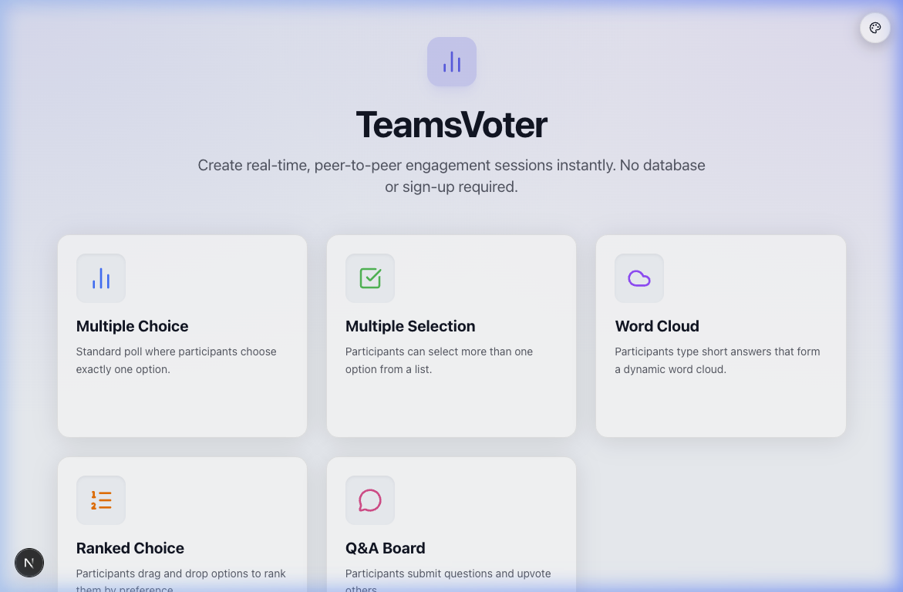
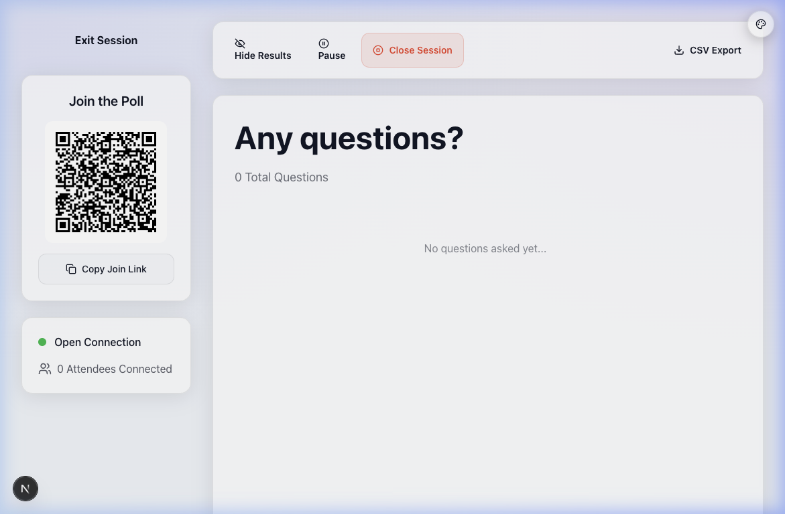
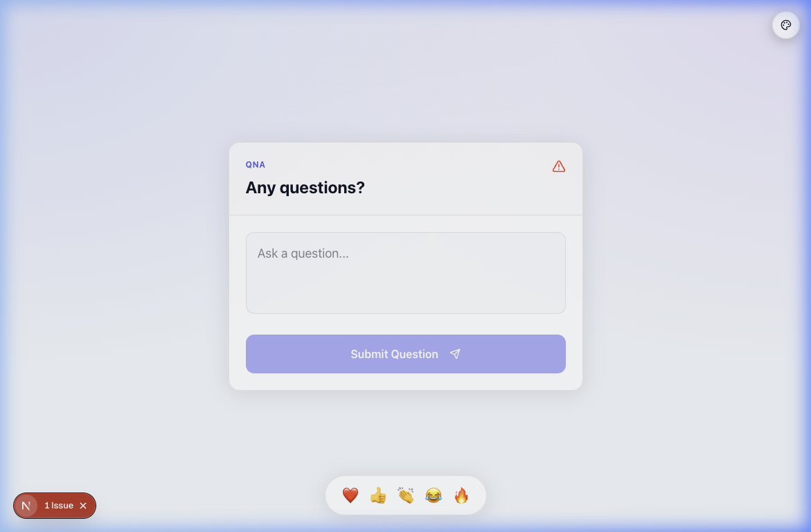
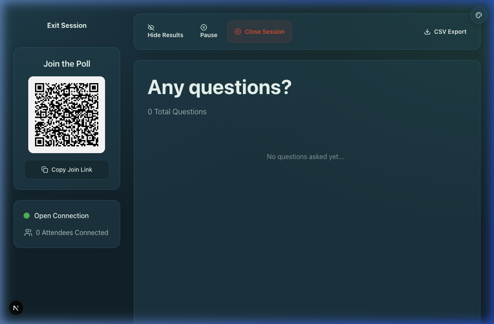

<div align="center">
  

  # TeamsVoter (LivePoll)

  **A real-time, peer-to-peer polling application** built with modern web technologies. Create polls, share join links, and vote in real-time without relying on a central database or WebSocket server!

  [](https://nextjs.org/)
  [](https://react.dev/)
  [](https://tailwindcss.com/)
  [](https://github.com/pmndrs/zustand)
  [](https://peerjs.com/)

</div>

---

## 📸 See it in Action

<p align="center">
  
</p>
<p align="center">
  
</p>

## ✨ Features

- ⚡️ **P2P Real-time Updates**: Uses WebRTC via `peerjs` for instant vote broadcasting from participants directly to the host.
- 🚫 **No Database Required**: The host's browser acts as the source of truth for the poll session.
- 🔄 **Cross-Tab Syncing**: Leverages `zustand` with local storage persistence to act as a reliable fallback when PeerJS fails (especially useful for same-browser testing).
- 🔗 **Auto-Generating Join Links**: Includes encoded poll data inside the join URL, so participants instantly see the question and choices without an initial server roundtrip.
- 🎨 **Interactive UI**: Built with `framer-motion` for smooth percentage bar animations and `lucide-react` for beautiful iconography.
- 📊 **Multiple Poll Types**: Supports traditional Multiple Choice, Ranked Choice voting, dynamic Word Clouds, and live Q&A Boards with upvoting.
- 💅 **Modern Styling**: Styled with Tailwind CSS v4 and `clsx` / `tailwind-merge` for robust utility class management.
- 🌈 **Colour Scheme Switcher**: Choose from four built-in themes — **Light** (default), **Midnight**, **Vivid** (orange/purple), and **Ocean** (teal/emerald). Selection is persisted in `localStorage` and applied globally via a floating palette button.

## 🎨 Colour Themes

TeamsVoter ships with four built-in colour schemes. A floating **palette button** (bottom-right corner) lets you switch themes at any time — your selection is saved in `localStorage` so it persists across sessions.

| Theme | Accent colours | Description |
|-------|---------------|-------------|
| ☀️ **Light** *(default)* | Indigo `#6366f1` · Purple `#a855f7` | Clean, bright background with vibrant indigo/purple accents |
| 🌙 **Midnight** | Blue `#3b82f6` · Violet `#8b5cf6` | Dark background with cool blue/violet accents |
| 🔥 **Vivid** | Orange `#f26419` · Purple `#7c3aed` | Dark background with punchy orange/purple contrast |
| 🌊 **Ocean** | Cyan `#06b6d4` · Emerald `#10b981` | Dark background with refreshing teal/green tones |

The active theme is applied as a `data-theme` attribute on `<html>` (e.g. `data-theme="midnight"`), and all CSS variables are scoped to each theme in `globals.css`.

<p align="center">
  
</p>

## 🛠️ Tech Stack

- **Framework**: [Next.js 15+](https://nextjs.org/) (App Router)
- **Language**: TypeScript
- **Styling**: Tailwind CSS v4
- **State Management**: [Zustand](https://github.com/pmndrs/zustand)
- **P2P Networking**: [PeerJS](https://peerjs.com/)
- **Icons**: Lucide React
- **Animations**: Framer Motion
- **QR Codes**: `qrcode.react`

## 📁 Project Structure

- `src/app/page.tsx`: The home page where hosts create a new poll.
- `src/app/host/[id]/page.tsx`: The host dashboard displays the QR code, connection status, and real-time voting results.
- `src/app/join/page.tsx`: The participant view. Decodes the poll from the URL and allows casting a single vote.
- `src/hooks/usePeer.ts`: Custom hook for the host to initialize a PeerJS instance and listen for incoming vote payloads.
- `src/hooks/usePeerConnection.ts`: Custom hook for participants to connect to the host's PeerJS instance and send votes.
- `src/lib/store.ts`: Zustand store for state management, including `localStorage` persistence and cross-tab synchronization.
- `src/lib/themeContext.tsx`: Theme context providing the active theme, `setTheme`, and the list of available themes.
- `src/app/components/ThemeSwitcher.tsx`: Floating palette UI component for switching colour schemes.
- `src/app/components/ClientProviders.tsx`: Client-side wrapper that injects the theme provider and switcher into the server layout.

## 🚀 Getting Started

### Prerequisites

- Node.js (v20+ recommended)
- npm, yarn, pnpm, or bun

### Installation

1. **Clone the repository and navigate to the project directory:**
   ```bash
   git clone https://github.com/RookieZA/TeamsVoter
   cd TeamsVoter
   ```

2. **Install the dependencies:**
   ```bash
   npm install
   ```

3. **Run the development server:**
   ```bash
   npm run dev
   ```

4. **Start Polling:** Open [http://localhost:3000](http://localhost:3000) with your browser to create a poll.

## 🧠 How it Works

1. 🏠 **Host Setup**: When a host creates a poll, `usePeer` initializes a new `Peer` with a unique ID. The poll data (question and choices) is saved to the local Zustand store.
2. 🔗 **Join Link Generation**: The host dashboard generates a join URL containing the host's Peer ID and a base64 encoded payload of the poll question and choices.
3. 👤 **Participant Join**: When a participant opens the join link, the page decodes the URL to display the poll. `usePeerConnection` attempts to connect to the host's Peer ID.
4. 🗳️ **Voting**: Upon voting, the participant sends a `VOTE` payload over the WebRTC data channel. 
5. 🛡️ **Fallback Mechanism**: To handle scenarios where WebRTC fails to connect (e.g., restricted networks or same-browser tab testing), joining participants also directly update the shared Zustand store. A `storage` event listener on the host side detects changes to `localStorage` and rehydrates the results immediately.

---
<div align="center">
  <i>Built with ❤️ for real-time engagement.</i>
</div>
